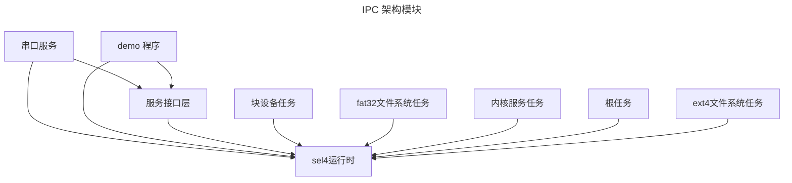

# rel4-linux-kit

> rel4 linux kit 提供一套工具和服务以便于 linux app 运行在 rel4、sel4 之上

## 环境安装

#### 安装 musl gcc 工具链

> 请确保您已安装 `aarch64-linux-musl-cross`,如果没有安装可以先执行

```shell
wget https://musl.cc/aarch64-linux-musl-cross.tgz
tar zxf aarch64-linux-musl-cross.tgz
export PATH=$PATH:`pwd`/aarch64-linux-musl-cross/bin
```

> 安装 sel4-kernel-loader-add-payload

```shell
cargo install --git https://github.com/seL4/rust-sel4 --rev 1cd063a0f69b2d2045bfa224a36c9341619f0e9b sel4-kernel-loader-add-payload
```

#### 下载 sel4 内核

```shell
mkdir -p .env
wget -qO- https://github.com/yfblock/rel4-kernel-autobuild/releases/download/release-2025-03-26/seL4.tar.gz | gunzip | tar -xvf - -C .env --strip-components 1
```

## 运行

运行时会自动下载测例，然后创建 testcases 文件夹，后续需要添加测例，可以给 testcases 文件夹中添加内容实现。

```shell
tools/app-parser.py kernel-thread block-thread uart-thread
make disk_img

make run

## if you want to get a clean output.
make run LOG=error
```


